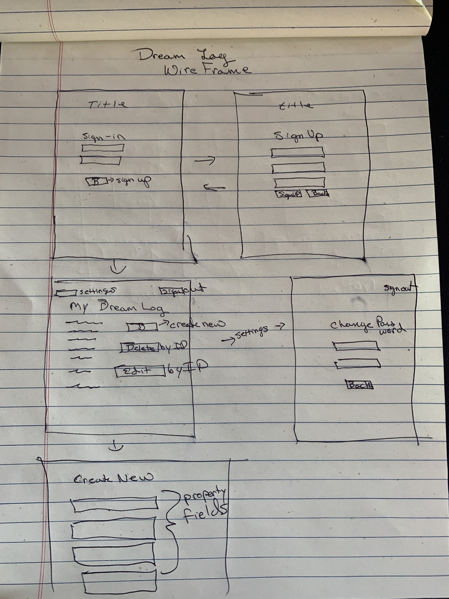

# Dream-Log

## About
This project represents basic user functionality for a website that communicates with a database through an api.

I sought out to create a dream-log app where users could CRUD and view other user's posts. Users may only delete and edit their own posts.

## Links
- [API Back-End Repo](https://github.com/wpMcDonnell/dream-log)
- [Deployed API URL](https://mysterious-forest-15035.herokuapp.com)
- [Deployed Client Site](https://wpmcdonnell.github.io/dream-log-client/)

## Planning
First I created a wireframe and users stories to physically conceputalize how I wanted the app and layout to look. I also created a ERD to conceptualize how the app would talk to the API. I then proceeded on coding out the basic auth and dream forms.

## Technologies Used

During this project I used Javascript and jQuerey to create the front-end, HTML5 as the basic framework and template for the website, and ajax to communicate via the api to make requests to a mongodb data base containing user and dream data. I used express and mongoose to create the API and routes to the database eventually hosted on heroku. Finally I used CSS for styling. I also used bootstap icons.

* jQuery
* HTML/CSS
* Bootstrap
* Javascript
* express
* mongodb / mongoose
* Heroku

## User Stories

* As a user, I want to be able to sign up, sign in, change my password, and sign-out
* As a user, I want to be able to enter a dream instance (POST)
* As a user, I want to be able to edit my own dream description (PATCH)
* As a user, I want other users to be able to comment on my dreams (stretch)
* As a user, I want to be able to comment on other user's dreams (stretch)
* As a user, I want to be able to set my dreams to public or private (stretch?)
* As a user, I want to be able to delete my dream posts
* As a user, I want to be able to get all my dream posts or a specific dream post
* As a user, I want to be able to upload an image with my dream posts (stretch)

## Unsolved Problems

I would like to make the area for the dreams be more contained interms of layout, akin to twitter,a nd also have users upload profile pictures, and be able to comment on other dreams.

## WireFrame

